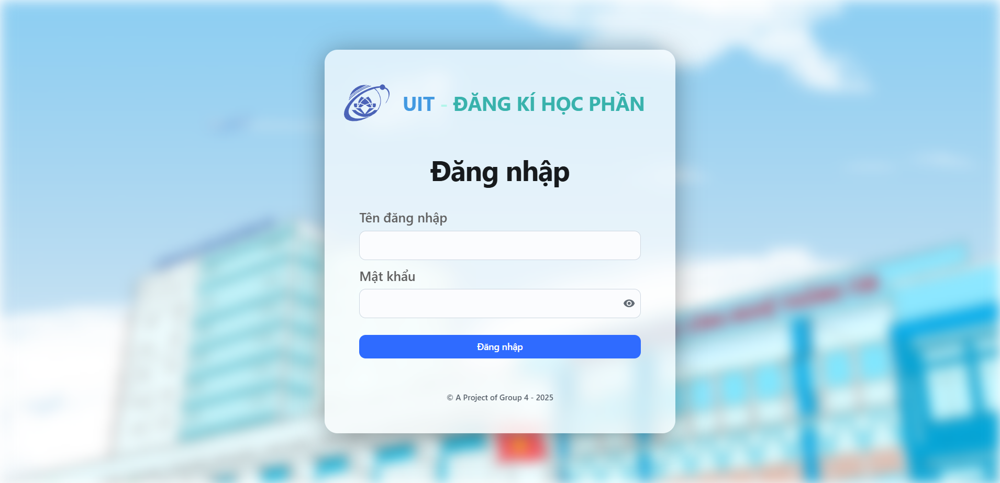
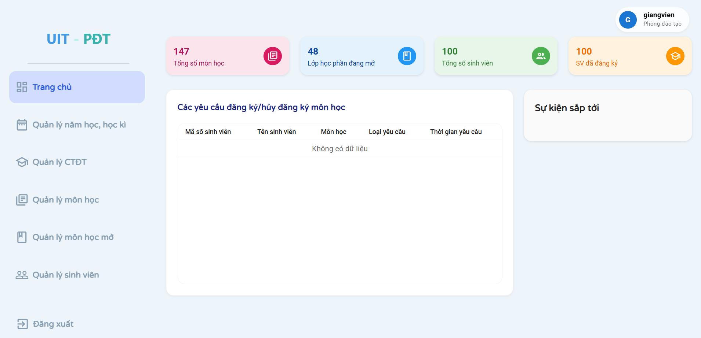
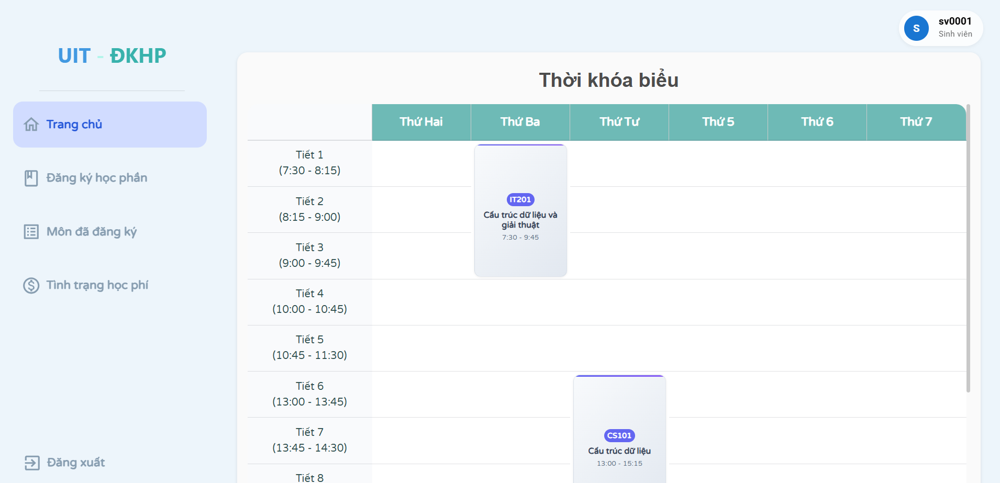
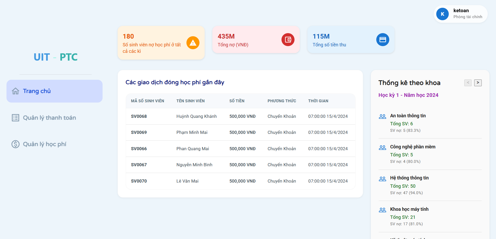
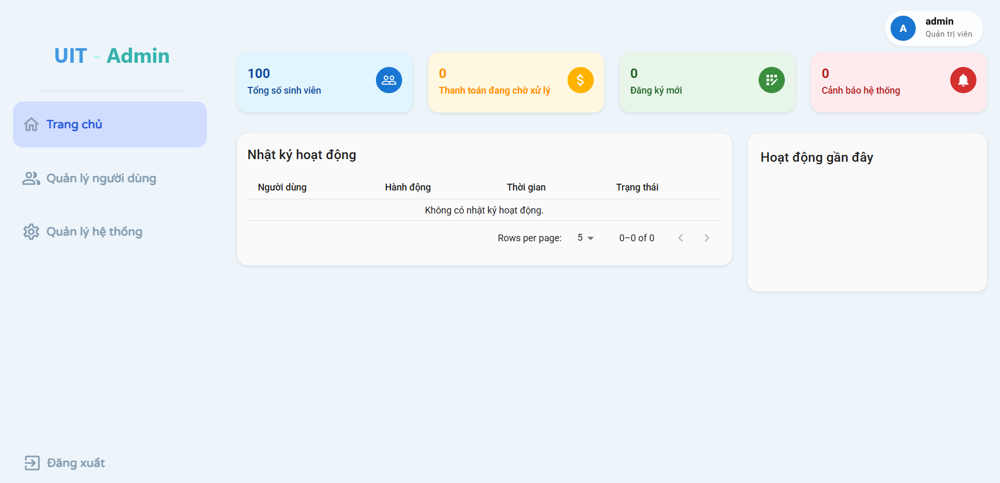

# 🎓 Course Registration and Tuition Fee Management System

**A comprehensive course registration and tuition fee management system built with React TypeScript and Node.js**

[](LICENSE)
[](https://reactjs.org/)
[](https://www.typescriptlang.org/)
[](https://nodejs.org/)

---

## 📋 Table of Contents

- [Introduction](#introduction)
- [Features](#features)
- [Technology Stack](#technology-stack)
- [Getting Started](#getting-started)
- [Project Structure](#project-structure)
- [API Documentation](#api-documentation)
- [Screenshots](#screenshots)
- [Contributing](#contributing)
- [License](#license)
- [Contact](#contact)

---

## 📌 Introduction

**Project Title: COURSE REGISTRATION AND TUITION FEE MANAGEMENT SYSTEM FOR STUDENTS**

This is a comprehensive course registration and tuition fee management system developed for the **University of Information Technology - VNU-HCM (UIT)** as part of the **SE104 - Introduction to Software Engineering** course.

The system provides a modern web interface to manage:
- **Course Registration** for students by semester
- **Tuition Fee Collection** and related financial management
- **Course Management** and academic information
- **Financial Reporting** and analytics

The system supports multiple user roles including students, academic affairs staff, financial department staff, and system administrators.

---

## ✨ Features

### 📚 Course Registration Management
- **Course Offering**: Create and manage courses offered each semester
- **Course Registration**: Students register for courses according to schedule
- **Class Management**: Track enrollment and student lists for each class
- **Timetable Management**: Schedule classes and manage academic calendar
- **Prerequisites**: Check registration requirements and course prerequisites

### 💰 Tuition Fee Management
- **Fee Calculation**: Automatically calculate tuition based on registered credits
- **Payment Processing**: Handle tuition payment transactions
- **Debt Tracking**: Monitor student payment status and outstanding balances
- **Financial Reporting**: Generate revenue reports and payment statistics
- **Discount Policies**: Apply scholarship and financial aid policies

### 👨‍🎓 Student Portal
- **Dashboard**: Overview of academic and financial information
- **Course Registration**: Browse and register for available courses
- **Payment Interface**: View and pay tuition fees
- **Academic History**: Track academic progress and grades
- **Personal Schedule**: Individual class timetable and course information

### 🏫 Academic Affairs Management
- **Course Management**: Create and update course information
- **Program Management**: Manage academic programs and curricula
- **Class Scheduling**: Create semester classes with enrollment limits
- **Student Management**: Track student information and academic progress
- **Academic Reports**: Generate registration and academic statistics

### 💼 Financial Department Management  
- **Tuition Management**: Set tuition rates by course type
- **Payment Processing**: Manage tuition collection transactions
- **Revenue Reports**: Generate income statistics by semester and academic year
- **Debt Management**: Track students with outstanding payments
- **Pricing Policy**: Configure fee structures and discount policies

### 🔧 System Administration
- **User Management**: Role-based access control and account management
- **System Configuration**: Setup system parameters and maintenance
- **Activity Logs**: Monitor system operations and user activities
- **System Analytics**: Generate comprehensive system usage reports

---

## 🛠 Technology Stack

### Frontend
- **React 18** with TypeScript
- **Material-UI (MUI)** for component library
- **React Router v6** for navigation
- **Axios** for API communication
- **Vite** for build tools

### Backend
- **Node.js** with Express.js
- **TypeScript** for type safety
- **JWT Authentication** for security
- **PostgreSQL** database
- **Business Layer Architecture** for complex logic

### Design Patterns
- **MVC Pattern**: Separation of Controllers, Services, and Business Logic
- **Repository Pattern**: Database abstraction layer
- **Service Layer**: Business logic encapsulation
- **Role-based Access Control**: Multi-level authorization

---

## 🚀 Getting Started

### Prerequisites
- Node.js (v18+)
- Docker and Docker Compose
- npm or yarn package manager

### Quick Start with Docker (Recommended)

1. **Clone the repository**
   ```bash
   git clone https://github.com/Janus-Aurelius/Master_CNPM.git
   cd Master_CNPM
   ```

2. **Start Backend with Docker**
   ```bash
   cd master_backend_nodejs\master_backend_nodejs\Docker
   docker-compose up --build
   ```
   This will start the backend server and database automatically.

3. **Start Frontend**
   ```bash
   cd frontend\master_frontend_tsx
   npm install
   npm run dev
   ```

4. **Access the Application**
   - Frontend: `http://localhost:5173`
   - Backend API: `http://localhost:3001`

### Manual Installation (Alternative)

1. **Clone the repository**
   ```bash
   git clone https://github.com/Janus-Aurelius/Master_CNPM.git
   cd Master_CNPM
   ```

2. **Backend Setup**
   ```bash
   cd master_backend_nodejs/master_backend_nodejs
   npm install
   
   # Configure environment variables
   cp .env.example .env
   # Edit .env with your database credentials
   ```

3. **Frontend Setup**
   ```bash
   cd frontend/master_frontend_tsx
   npm install
   ```

4. **Database Setup**
   ```bash
   # Run database migrations (if available)
   npm run migrate
   
   # Seed initial data
   npm run seed
   ```

5. **Start the Application**
   ```bash
   # Start backend (from backend directory)
   npm run dev
   
   # Start frontend (from frontend directory)
   npm run dev
   ```

6. **Access the Application**
   - Frontend: `http://localhost:5173`
   - Backend API: `http://localhost:3001`

---

## 🗂 Project Structure

```
course-registration-system/
├── frontend/
│   └── master_frontend_tsx/           # React TypeScript frontend
│       ├── src/
│       │   ├── academic_affair_pages/ # Academic staff interface
│       │   ├── admin_pages/           # Administrator interface
│       │   ├── financial_dpm_pages/   # Financial department interface
│       │   ├── student_pages/         # Student portal
│       │   ├── api_clients/           # API communication layer
│       │   ├── components/            # Reusable UI components
│       │   └── styles/                # Theme and styling
│
└── master_backend_nodejs/
    └── master_backend_nodejs/         # Node.js Express backend
        ├── src/
        │   ├── controllers/           # Request handlers
        │   ├── business/              # Business logic layer
        │   ├── services/              # Data access layer
        │   ├── models/                # TypeScript interfaces
        │   ├── routes/                # API route definitions
        │   ├── middleware/            # Authentication & validation
        │   └── utils/                 # Helper utilities
        └── Docker/                    # Containerization files
```

---

## 📚 API Documentation

### Authentication Endpoints
- `POST /api/auth/login` - User authentication
- `POST /api/auth/refresh` - Token refresh
- `POST /api/auth/logout` - User logout

### Academic Endpoints
- `GET /api/academic/courses` - Manage courses
- `GET /api/academic/programs` - Academic programs
- `GET /api/academic/students` - Student management
- `GET /api/academic/dashboard/stats` - Academic statistics

### Student Endpoints
- `GET /api/student/dashboard` - Student dashboard data
- `GET /api/student/timetable` - Personal schedule
- `POST /api/student/register-courses` - Course registration
- `GET /api/student/tuition-status` - Payment information

### Financial Endpoints
- `GET /api/financial/dashboard/overview` - Financial overview
- `POST /api/financial/payments` - Process payments
- `GET /api/financial/config` - Fee configuration

### Admin Endpoints
- `GET /api/admin/users` - User management
- `GET /api/admin/system/maintenance` - System maintenance
- `GET /api/admin/dashboard/summary` - System statistics

---

## 📸 Screenshots

### 🔐 Login Interface

*Secure authentication portal with role-based access control*

### 🎓 Academic Affairs Dashboard

*Academic staff interface for course management, student registration, and program administration*

### 👨‍🎓 Student Portal

*Student dashboard with course enrollment, timetable, and tuition payment features*

### 💰 Financial Department Interface

*Financial management system for tuition tracking, payment processing, and revenue analytics*

### ⚙️ Administrator Panel

*System administration interface for user management and system configuration*

---

## 🎯 Key Highlights

- **Multi-Role Dashboard**: Customized interfaces for different user types
- **Real-time Data**: Live updates for registration and payment information
- **Academic Calendar**: Semester management and registration schedules
- **Payment Integration**: Comprehensive tuition and fee management system
- **Responsive Design**: Mobile-friendly interface
- **Security**: JWT authentication with role-based authorization
- **Audit Trail**: Complete logging of activities and changes

---

## 🤝 Contributing

We welcome all contributions! To contribute:

1. Fork the repository
2. Create your feature branch (`git checkout -b feature/AmazingFeature`)
3. Commit your changes (`git commit -m 'Add some AmazingFeature'`)
4. Push to the branch (`git push origin feature/AmazingFeature`)
5. Open a Pull Request

---

## 📄 License

This project is licensed under the **MIT License** - see the [LICENSE](LICENSE) file for details.

---

## 📬 Contact

- **Course**: SE104 – Introduction to Software Engineering
- **University**: University of Information Technology - VNU-HCM (UIT)  
- **Project Title**: Course Registration and Tuition Fee Management System for Students
- **Email**: 23521672@gm.uit.edu.vn
- **Repository**: [GitHub Repository](https://github.com/Janus-Aurelius/Master_CNPM.git)

---

## 🙏 Acknowledgments

- **UIT Faculty**: Guidance and project requirements
- **SE104 Course**: Software Engineering principles and methodologies
- **Development Team**: Collaborative efforts and dedication
- **Open Source Libraries**: React, Material-UI, Express.js and other dependencies
- **University of Information Technology**: Providing the learning environment
